Bandaru Mahendra · GitHub Profile

<picture>
  <source media="(prefers-color-scheme: dark)" srcset="./dark.svg">
  <source media="(prefers-color-scheme: light)" srcset="./light.svg">
  
</picture>

About

I am a Software Engineer and AI-focused developer with a foundation in Python, backend engineering, AI/ML, cybersecurity, and product development.

My current focus is on building practical software with Python, FastAPI, REST APIs, AI/ML workflows, computer vision, automation, and security engineering. I am also strengthening DSA, system design, and modern agentic-AI architecture skills.

Open to

Software Engineering

Python Development

AI / ML Engineering

Backend Engineering

Full-Stack Development

Cybersecurity / VAPT / SOC

AI Agent & Automation projects

Open-source collaboration

Engineering Stack

Area

Technologies

Languages

Python, C, C++, HTML, CSS, JavaScript

Backend

FastAPI, REST APIs, Node.js

Frontend

React, Vite

AI / ML

AI model integration, OpenCV, NumPy, Pandas, TF-IDF, cosine similarity, RAG concepts

Security

Nmap, Burp Suite, Wireshark, Nessus, Kali Linux, VirtualBox

Tools / Platforms

Git, GitHub, Docker, Linux, AWS, Vercel, Postman, VS Code

Data / DB

MySQL, MongoDB, PostgreSQL, Redis

Featured Projects

01 · AI Resume Tailoring Platform

An AI-powered application that analyzes job descriptions and tailors resume content toward relevant requirements.

Stack: Python · FastAPI · REST APIs · AI Models · React · Vite

FastAPI backend for resume-processing workflows

AI model integration for job-description-driven customization

REST communication between frontend and backend

Document generation and single-page resume formatting

Deployment-oriented application architecture

02 · Image & Text Plagiarism Detection

A B.Tech project combining text similarity analysis and computer vision to identify potential plagiarism across textual and visual content.

Stack: Python · OpenCV · TF-IDF · Cosine Similarity · NumPy

TF-IDF feature extraction for text

Cosine similarity for document comparison

OpenCV-based image-processing workflows

Unified text + image plagiarism-detection concept

03 · Weather Application

A full-stack weather application using geocoding and forecast APIs with a Python backend and React/Vite frontend.

Stack: Python · FastAPI · React · Vite · Open-Meteo · REST APIs

Open-Meteo geocoding and forecast integration

FastAPI endpoints for weather retrieval

Location-based weather queries

Frontend/backend API integration

Deployment and production debugging experience

04 · Telegram Trading Signal Automation

A Python automation workflow designed to read selected Telegram signals, extract structured information, cache instruments, and integrate with broker APIs.

Stack: Python · Telethon · SmartAPI · Requests · Regex · JSON

Telegram message processing with Telethon

Structured signal extraction from unstructured messages

Regex-based symbol, strike, option type, and price extraction

Instrument-master caching

Duplicate-signal tracking

Angel One SmartAPI integration

Experience

Technical Support — Network L2 · ConnectSecure

Technical Support · Network Security · Vulnerability Management

Supported security products used to identify system vulnerabilities

Worked across Windows, Linux, and macOS environments

Investigated security-scanning and technical issues

Used Nessus for vulnerability assessment and troubleshooting

Worked across networking and system-level troubleshooting scenarios

VAPT Intern · Cartel Software Pvt. Ltd.

May 2023 — Oct 2023

Assisted with vulnerability assessment and penetration-testing activities

Worked with common web application security concepts

Gained practical exposure to penetration-testing workflows

Used Burp Suite, Nmap, and Wireshark

Built foundational understanding of OWASP-oriented application security

Education

B.Tech — Computer Science & Engineering
St. Mark Educational Institution Society Group of Institutions · JNTU Anantapur
CGPA: 6.67

Certification

Certified Ethical Hacker (CEH)

Current Focus

Learning:
  - Data Structures & Algorithms
  - System Design
  - Advanced Python
  - AI Engineering
  - LLM Application Architecture
  - Agentic AI Systems

Building:
  - AI-powered developer tools
  - Production-ready FastAPI services
  - AI agents and automation workflows
  - Full-stack applications
  - Security-focused engineering projects

Exploring:
  - Generative AI
  - RAG architectures
  - Multi-agent systems
  - LLM orchestration
  - Cloud-native engineering
  - Scalable backend architecture

Connect

GitHub: Mahendra-dev-hub

LinkedIn: mahendra-bhandaru

Email: mahendramahe7684@gmail.com

LeetCode: mahe5757

  Designed as a self-contained terminal-inspired profile identity · Dark / Light theme ready

